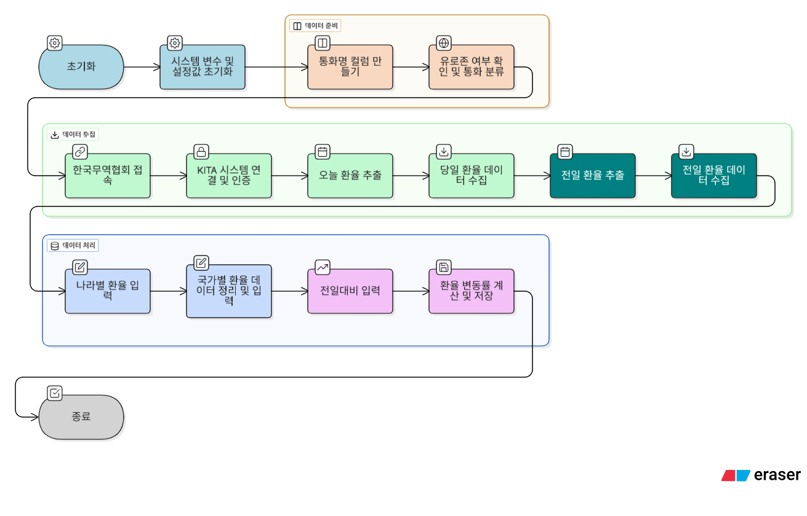

Project1_나라별실시간 환율조사/README.md
# 프로젝트 1. 나라별 실시간 환율 조사 자동화

## 📌 프로젝트 개요

본 프로젝트는 한국무역협회(KITA) 사이트에서 실시간 환율 정보를 추출하여,  
국가별 환율을 자동으로 매칭 및 입력하고, 전일 대비 환율 변동률까지 계산해주는 RPA 자동화 프로세스입니다.

---

## 🎯 과제 정보

- **과제명**: 나라별 실시간 환율 조사  
- **담당 부서**: 구매팀  
- **수행 주기**: 월~금 (공휴일 제외)  
- **수행 방식**: 스케줄 기반 자동화

---

## 🛠 사용 기술

- **UiPath**: 웹 자동화, 엑셀 자동 입력, 예외 처리  
- **Excel**: 국가명 기반 VLOOKUP 유사 매칭  
- **웹 크롤링 대상**: 한국무역협회(KITA) 사이트

---

## 📌 요구 사항

1. 각 나라별 실시간 환율 정보를 입력할 때, 유로존에 해당하는 나라는 **유럽(EUR) 환율**을 입력합니다.  
2. 국가명 기준으로 환율 정보를 **VLOOKUP 방식으로 자동 매칭**하여 엑셀에 입력합니다.  
3. 사용 파일명: `한국수출입_및_환율조사_ADVANCED.xlsx`  
4. 오늘 환율과 전일 환율을 비교하여 **전일대비 증감률**을 계산하고 입력합니다.

---

## 🔎 프로세스 상세 설명

1. **한국무역협회(KITA)** 사이트 접속 → https://www.kita.net/  
2. 상단 메뉴에서 **[공지·뉴스] → [환율종합]** 선택  
3. **오늘 날짜 기준 환율정보**를 조회하여 실시간환율 데이터 추출  
4. 전일 환율 조회 시, 달력 아이콘 클릭 → 전일 선택 → 조회 버튼 클릭  
5. **환율 정보가 없는 경우**, 가장 가까운 이전 날짜의 데이터로 대체 추출  
6. 오늘과 전일 환율 데이터를 기준으로 **전일대비 증감률** 계산

---

## 💱 환율 처리 워크플로우

### 🧭 전체 단계 요약

| 단계 | 설명 |
|------|------|
| ✅ **STEP 1. 기본 변수 초기화** | 시스템 변수 및 설정값 초기화 |
| ✅ **STEP 2. 통화명 컬럼 만들기** | 유로존 여부 확인 및 통화 분류 |
| ✅ **STEP 3. 한국무역협회 접속** | KITA 시스템 연결 및 인증 |
| ✅ **STEP 4. 오늘 환율 추출** | 당일 환율 데이터 수집 |
| ✅ **STEP 5. 전일 환율 추출** | 전일 환율 데이터 수집 |
| ✅ **STEP 6. 나라별 환율 입력** | 국가별 환율 정리 및 엑셀 입력 |
| ✅ **STEP 7. 전일대비 입력** | 환율 변동률 계산 및 저장 |

---

### 🌟 주요 자동화 포인트

- 🔄 **환율 데이터 자동 수집**  
  → 한국무역협회 웹사이트에서 실시간 환율 정보 크롤링

- 🌍 **유로존 국가 처리**  
  → 유럽 통화 단일 적용 로직 적용 (EUR)

- 📉 **전일 대비 비교 기능**  
  → 변동률 계산 및 누적 기록 자동화

- 📊 **엑셀 기반 자동 입력**  
  → 국가명 매칭 및 조건 분기 처리로 정확한 값 입력

---

## 📷 자동화 흐름도

아래는 전체 프로세스의 시각화 흐름도입니다.  
실제 UiPath 로직을 기준으로 주요 단계가 정리되어 있습니다.

> 📌 더 크게 보고 싶다면 👉  
> 🔗 [**웹에서 보기 (Gensparkspace)**](https://qpoenrxb.gensparkspace.com/)

---

## 🧩 통화명 컬럼 자동 생성 로직

환율 입력의 핵심은 각 국가별로 어떤 통화를 기준으로 입력할지를 정확히 구분하는 것입니다.  
이를 위해 수출입 시트의 국가명 기준으로, 유로존 시트와 비교하여 **'통화명' 컬럼을 자동 생성**합니다.

### 💡 처리 방식

1. **엑셀 '수출입' 시트**를 `DT_Trade`로, **'유로존' 시트**를 `DT_EuroZone`으로 불러옵니다.
2. `DT_Trade`에 `"통화명"`이라는 새 컬럼을 추가합니다.
3. 각 국가별로 For Each Row 반복문을 돌며 아래 기준으로 통화명을 입력합니다:

| 조건 | 처리 결과 |
|------|------------|
| 해당 국가가 유로존에 포함됨 | `"유럽"` 입력 → 유로(EUR) 환율 사용 |
| 유로존이 아님 | 해당 국가명을 그대로 `"통화명"`으로 입력 |

4. 최종적으로 생성된 `"통화명"` 컬럼을 기준으로 실시간 환율을 자동 입력하게 됩니다.

### 📌 예시

| 국가명 | 통화명 |
|--------|--------|
| 독일   | 유럽   |
| 일본   | 일본   |
| 프랑스 | 유럽   |
| 미국   | 미국   |

이 구조 덕분에 후속 환율 입력 자동화가 훨씬 단순해지며,  
`"유럽"`이면 EUR 환율을, 나머지 국가는 해당 국가의 환율을 정확하게 삽입할 수 있습니다.

---

## 🗓️ 날짜 처리 자동화 로직

- 자동화 실행 시 기준 날짜는 `Now`를 사용해 오늘 날짜(`TargetDate`)로 저장됩니다.
- 단, 오늘이 주말(토요일 또는 일요일)인 경우에는 **가장 가까운 평일(금요일)**로 날짜를 자동 조정합니다.
- 최종 날짜는 `.ToString("yyyy.MM.dd")` 형식으로 변환하여 `Str_FormattedDate` 변수에 저장되며,
  e-나라지표 검색창에 `Type Into` 액티비티로 입력됩니다.

> ✅ `Type Into` 사용 시 입력 필드가 **비활성화(Disabled)** 되어 있을 수 있으므로,  
> **"Click before typing" 설정 활성화**, 또는 **`Activate` 액티비티로 포커싱 후 입력** 구조를 사용하는 것이 안정적입니다.

- 날짜 입력 후에는 **"검색" 버튼을 클릭**하여 해당 날짜의 환율을 조회합니다.

---

## 📊 엑셀 파일 작업

1. `한국수출입_및_환율조사_ADVANCED.xlsx` 파일을 열고  
   - **[유로존] 시트**에서 해당 국가 목록 확인  
   - 유로존에 해당하는 국가는 **EUR 환율 기준으로 입력**

2. **[수출입] 시트** 선택 후 국가명별로 환율을 입력  
   - 오늘 환율과 전일 환율 차이 = `전일대비` 열에 자동 계산  
   - 표기 기준:
     - ✅ 증감값 > 0: `"▲"` + 값
     - ✅ 증감값 < 0: `"▼"` + 절대값
     - ✅ 증감값 = 0: `"-"` 또는 `"▲"`  
   - 소수점 둘째 자리에서 반올림 처리

3. 엑셀 자동화 로직은 **Write Cell 또는 Write Range** 기반으로 구성되며,  
   정렬된 국가 순서 기준으로 입력됩니다.

---

## 📌 기타 정보

- 해당 로봇은 업무 자동화 효율성 향상, 입력 오류 감소, 반복 업무 제거를 목적으로 제작되었습니다.  
- 향후 개선사항: 크롤링 속도 개선, 환율 API 연동 고려, 사용자 입력 UI 강화

---

📁 프로젝트 전체 구조는 GitHub 상에서 확인 가능하며,  
이미지 및 시연 영상은 추후 업데이트될 예정입니다.

> 작성자: 구나경  
> 이메일: (필요 시 기재 가능)  
> 날짜: 2025년 6월 기준

---
