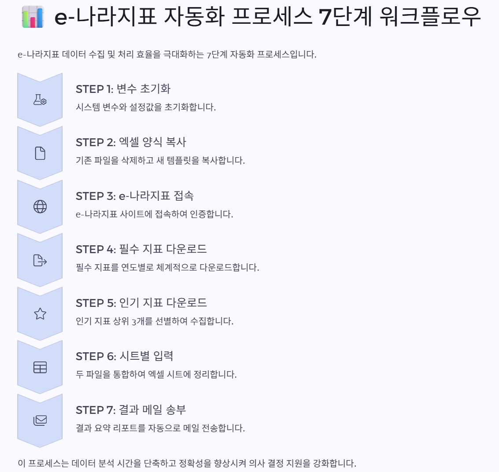

Project2_e-나라지표 자동 수집 및 엑셀 정리 자동화/README.md
# 프로젝트 2. e-나라지표 인기지표 자동 수집 및 보고서 이메일 전송

## 📌 프로젝트 개요

본 프로젝트는 e-나라지표 사이트에서 상위 인기지표 5개를 조회하여  
엑셀로 다운로드한 뒤, 시트별로 정리하고  
최종 엑셀 보고서를 메일로 자동 전송하는 RPA 자동화 프로세스입니다.

---

## 🎯 과제 정보

- **과제명**: e-나라지표 인기지표 조사  
- **담당 부서**: 마케팅팀  
- **수행 주기**: 주 1회  
- **수행 방식**: 스케줄 기반 자동화

---

## 🛠 사용 기술

- **UiPath**: 웹 자동화, 엑셀 편집, 메일 발송  
- **Excel**: 양식 복사, 시트별 데이터 입력  
- **웹 크롤링 대상**: [e-나라지표 사이트](https://www.index.go.kr/enara)

---
## 📊 지표 수집 워크플로우

### 🧭 전체 단계 요약

| 단계 | 설명 |
|------|------|
| ✅ **STEP 1. 변수 초기화** | 시스템 변수 및 설정값 초기화 |
| ✅ **STEP 2. 엑셀 양식 복사** | 기존 결과 파일 삭제 후 템플릿 양식 복사 |
| ✅ **STEP 3. e-나라지표 접속** | e-나라지표 사이트 자동 접속 |
| ✅ **STEP 4. 필수 지표 다운로드** | 필수 지표를 연도별로 순차 다운로드 |
| ✅ **STEP 5. 인기 지표 다운로드** | 필수와 중복되지 않는 인기지표 3개만 다운로드 |
| ✅ **STEP 6. 시트별 입력** | 두 통계 파일을 엑셀 시트로 통합 정리 |
| ✅ **STEP 7. 결과 메일 송부** | 결과 요약 파일을 이메일로 자동 전송 |

--- 

## 📌 조건 사항 (실습 기준)

1. 요청 양식에 **상위 5개 인기지표** 목록을 입력해야 함  
2. 다운로드한 데이터는 **오늘 날짜** 기준으로 파일명 및 시트에 기록되어야 함  
3. 자동화 완료 후, **결과 엑셀 파일은 이메일로 전송**되어야 함  
4. **필수지표 2개**는 엑셀에서 **노란색 셀 (RGB: FFFF00)** 로 구분되어야 함  
5. **필수지표와 인기지표가 중복되는 경우**, **1회만 다운로드**하고 **시트 입력 시 중복 처리 없이 통합 반영**되어야 함

---

## 🌟 주요 자동화 포인트

- ✅ **요청 양식 기반으로 작업 시작** (복사 후 양식 유지)  
- ✅ **다운로드 파일 이름 자동 정리** 및 시트별 구성  
- ✅ **날짜 기준 자동 입력** 및 파일명 동적 변경  
- ✅ **SMTP 기반 메일 발송 자동화** (수신자 이메일 변수화)

---

## 📷 자동화 프로세스 시각화

e-나라지표 데이터 수집 및 자동화 과정을 시각적으로 정리한 7단계 워크플로우입니다.  
데이터 수집부터 메일 전송까지의 전 과정을 한눈에 확인할 수 있습니다.

### 🖼️ 대표 이미지

### 🔗 전체 워크플로우 보기

- 🌐 [웹 프레젠테이션 보기 (Gamma 링크)](https://bqloqwgt.gensparkspace.com/)
- 📄 [PDF 다운로드 (e-7.pdf)](https://assets.api.gamma.app/export/pdf/kysfzpja5m6kr23/8b3ae7726d696ec05732cc45d021e7eb/e-7.pdf)

> 이 자료는 반복 업무를 자동화하는 전체 구조를 요약한 시각적 문서이며,  
> 프로젝트 발표 및 실무 보고에 바로 활용 가능한 구조로 작성되었습니다.
---

## 💻 사용 환경

- 운영 체제: Windows 10 / 11  
- UiPath Studio: 2023.10.3  
- 웹사이트: [e-나라지표](https://www.index.go.kr/enara)

---

## 🔧 사전 준비 사항

- 요청 양식 엑셀 파일이 사전에 존재해야 함  
- `Str_SourcePath`, `Str_ResultPath` 등 경로 변수 설정 필요  
- `Result` 폴더가 존재하고, 결과 파일 저장 경로가 명확히 지정되어야 함  
- 이메일 송/수신자 (`Str_EmailSender`, `Str_EmailReceiver`) 변수 설정 필수  
- SMTP 서버 및 포트, 인증 정보 설정 필요 (2단계 인증 사용 시 예외 처리 필요)

---

## 📦 사용된 패키지

- UiPath.Excel.Activities = 22.2.3  
- UiPath.Mail.Activities = 1.21.1  
- UiPath.System.Activities = 23.10.3  
- UiPath.UIAutomation.Activities = 23.10.7

---

## 📬 자동화 결과

- 📁 `Result` 폴더에 요청 양식 기반의 결과 엑셀 파일 자동 저장  
- 📨 수신자에게 결과 파일이 첨부된 메일 자동 전송  
- 📅 파일명 및 시트에 오늘 날짜 자동 입력됨  
- 🔁 반복 작업 없이 클릭 한 번으로 모든 프로세스 자동 수행

---

## 📁자세한 설계 흐름 및 액티비티 속성 설명
👉 [Notion 포트폴리오에서 확인하기](https://www.notion.so/Project2-e-20c4bbd537c980d7a84cc78e618b3be2?source=copy_link)

---

📁 프로젝트 전체 소스 및 시연 영상은 요청 시 별도 제공됩니다.

> 작성자: 구나경  
> 이메일: (필요 시 기재 가능)  
> 날짜: 2025년 6월 기준

---
